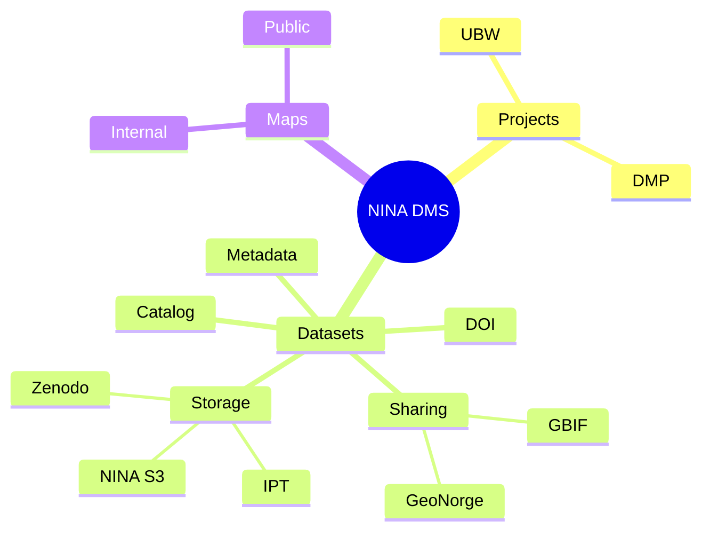

# NINA Data Management System (DMS)

## What is this system?

The NINA Data Management System (DMS) is a comprehensive Django-based web application which manages research data and projects at NINA. The system provides:

- **Project Management**: Create and manage research projects with team memberships and roles
- **Dataset Management**: Catalog, store, and manage research datasets with metadata
- **Data Management Plans (DMPs)**: Create and manage data management plans using configurable surveys
- **Storage Integration**: Connect to various storage backends (S3, Zenodo, IPT, GBIF)
- **Survey System**: Create and manage data collection surveys
- **API Access**: RestAPI for access to all resources
- **Geospatial Support**: Built-in support for geographic datasets using PostGIS

The system integrates with external services like LDAP for authentication, S3-compatible storage for data files, and various research data repositories for sharing and preservation.

## Requirements

- Docker
- uv

## How to setup

1. **Copy environment variables:**

```bash
cp .env.example .env
```

2. **Configure required environment variables** in `.env`: Only `POSTGRES_PASSWORD` and `DJANGO_SECRET_KEY` are required. For these values you can choose your own

3. **Start the application:**

```bash
# For development
docker compose --profile dev up -d --build

# For production
docker compose --profile prod up -d --build
```

## Verify the development setup

### Check application health

Visit the health check endpoint: `http://localhost:8000/ht/`

This endpoint will verify:

- Database connectivity
- Database migrations status

### Check individual services

1. **Main application**: `http://localhost:8000`
2. **Django admin**: `http://localhost:8000/admin/`
3. **API documentation**: `http://localhost:8000/api/v1/docs/`
4. **MinIO console** (dev only): `http://localhost:9091`
5. **PostgreSQL**: `localhost:5432` (accessible from host)

### Create a superuser (development)

A superuser is created on set-up. The username and password is both `admin`.

## Exposed ports and services

| Port | Service | Profile | Description |
|------|---------|---------|-------------|
| 8000 | Web Application | dev, prod | Main Django application (via Caddy in dev, Nginx in prod) |
| 5432 | PostgreSQL | both | Database server (accessible from host) |
| 9090 | MinIO API | dev | S3-compatible storage API |
| 9091 | MinIO Console | dev | Web interface for MinIO storage |

### Service architecture:

- **django/django-dev**: Main Django application server
- **queue/queue-dev**: Background task processor (Procrastinate worker)
- **tailwind**: CSS compilation service (dev only)
- **postgres**: PostGIS-enabled PostgreSQL database
- **proxy**: Nginx reverse proxy (production)
- **caddy**: Development reverse proxy with auto-reload
- **minio**: S3-compatible object storage (development)

## Development mode

**Start development environment:**

```bash
docker compose --profile dev up -d --build
```

**Development features:**

- Hot reload for code changes
- Tailwind CSS compilation with live updates
- Debug mode enabled
- Local file storage
- MinIO for S3 storage testing
- Volume mounts for live code editing

**Helper commands:**

In the `helpers.sh` file there are some helper commands which creates some useful aliases. To activate these use `. helpers.sh` 

## Production mode

**Start production environment:**

```bash
docker compose --profile prod up -d --build
```

**Production features:**

- Gunicorn WSGI server
- Nginx reverse proxy
- Static file serving
- Production-optimized settings
- No development tools

**Important for production:**

- Set a secure `DJANGO_SECRET_KEY`
- Configure proper `DJANGO_ALLOWED_HOSTS`
- Set up SSL/TLS termination (external)
- Configure backup procedures for PostgreSQL
- Set up monitoring and logging
- Configure external storage (S3) for files

## Debugging the application

### Django debugging

1. **Enable debug mode**: Already enabled in development settings
2. **Django admin**: `http://localhost:8000/admin/`
3. **Django shell**:

```bash
docker compose exec django-dev uv run manage.py shell
```

### Database debugging

```bash
# Connect to PostgreSQL
docker compose exec postgres psql -U postgres -d postgres

# View database schema
docker compose exec django-dev uv run manage.py dbshell
```

### API debugging

- **Swagger UI**: `http://localhost:8000/api/v1/docs/`
- **ReDoc**: `http://localhost:8000/api/v1/redoc/`
- **Raw schema**: `http://localhost:8000/api/v1/schema/`

## Structure


