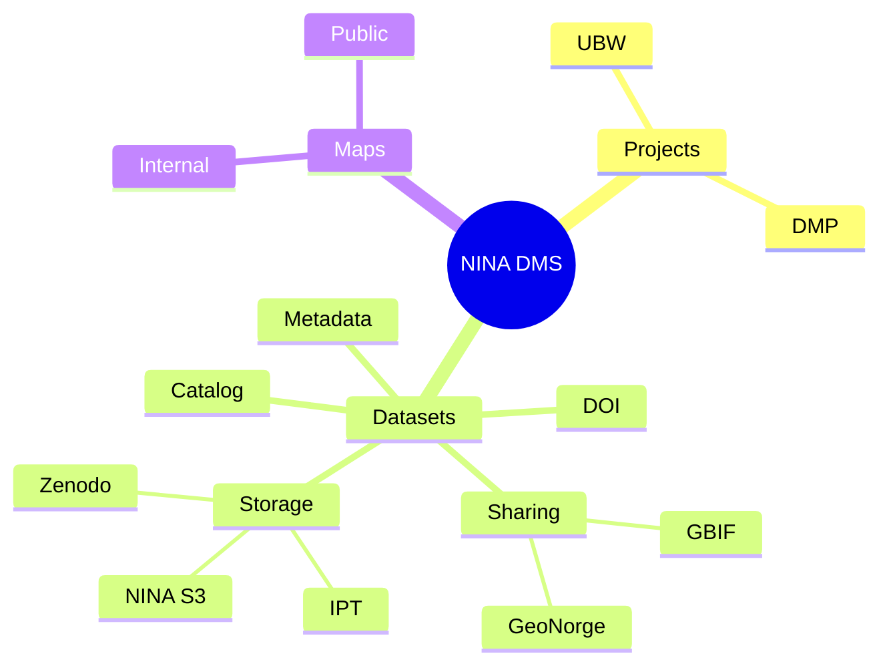

# NINA Data Management System (DMS)


## Requirements
- Docker
- uv

## How to setup
```bash
cp .env.example .env
# fill .env with values that make sense
source .helpers
dpcli_dev up -d
```

## Structure

