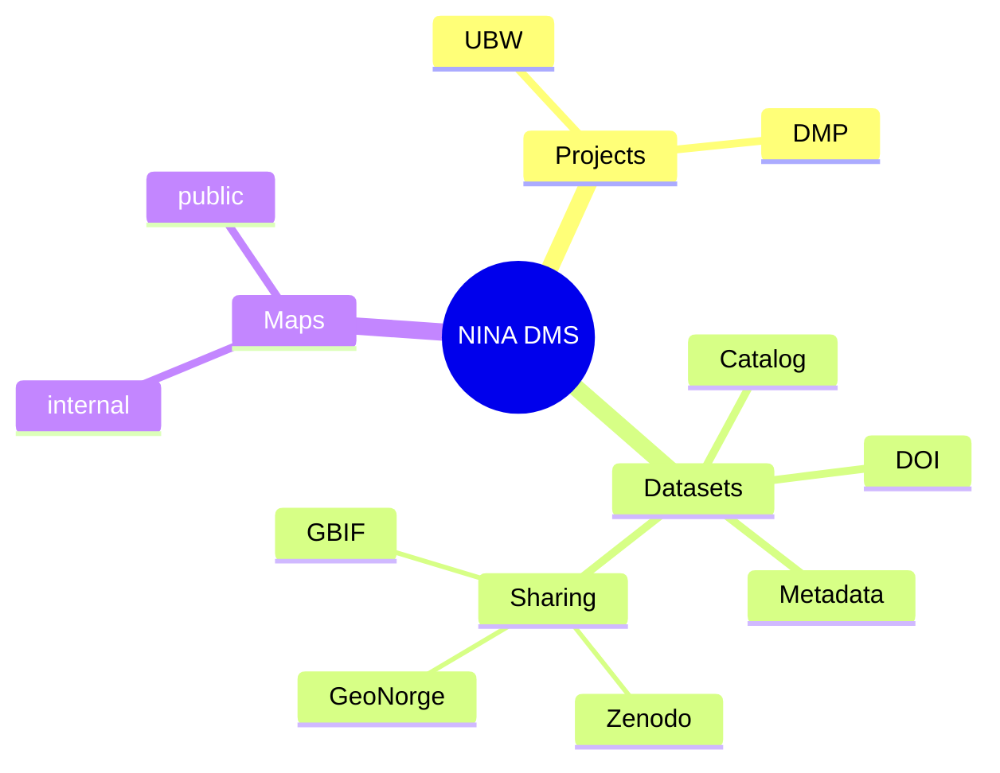

# Catalog


## Requirements
- Docker
- Nix (optional)
- Direnv (optional)

## How to setup
```bash
cp .env.example .env
# fill .env with values that make sense
docker compose --profile dev up -d --build
```

## Structure

