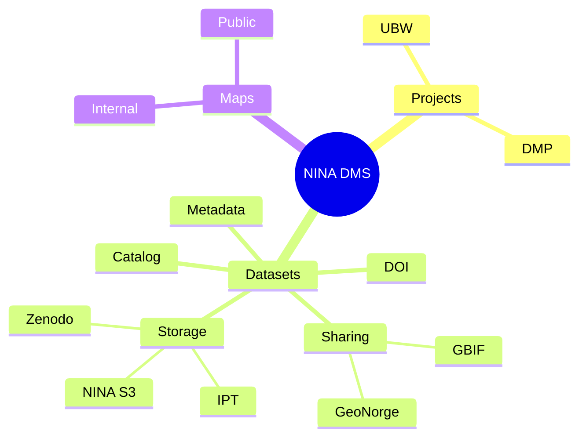

# NINA Data Management System
The NINA DMS is a platform for managing and linking together information that is usually scattered across different systems and formats. The system is designed to handle references between datasets, projects and IT Services.

## Key Features and design principles
- **Internal**: the system is designed to be hosted and used within an organization, not as a public web service.
- **Transparency**: all datasets and projects are visible to all users, promoting openness and collaboration.
- **Relationships**: the system promotes the linking between the managed entities, allowing to have a centralized view of:
    - how data are produced
    - which funds have produced a given dataset
    - who is responsible for a given dataset or project
    - where are data stored
- **Flexibility**: the system is designed to accommodate a variety of different data types, formats, metadata, storage types
- **Standardization**: the system encourages the use of standards for metadata
- **Cloud Native Formats**: the system is designed to take full advantage of cloud-native data formats and storage solutions
- **Automation**: the system tries to automate as much as possible the data management tasks, minimizing the additional information that users need to provide manually.

## Structure

